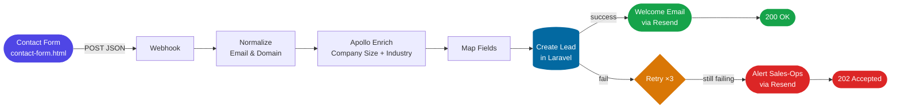

# Automated Lead Enrichment & Onboarding (MVP)

When someone fills in the public contact form, this system automatically
enriches the lead (looks up the company size), files it in an internal
dashboard, and emails the lead a welcome message — no manual copy/paste, no
data-entry errors.

---

## How the data flows (plain-English version)

1. **A visitor submits the contact form** (`contact-form.html`). The form
   POSTs name, email, company, and message to an n8n webhook.
2. **n8n cleans the data** — normalises the email, derives the company domain.
3. **n8n enriches the lead** via the Apollo API: company size + industry,
   looked up from the domain. (This replaces the manual "search LinkedIn for
   the company size" step.)
4. **n8n files the lead** by sending it to the Laravel app (`lead-app/`),
   which saves it. Re-submissions from the same email update the existing
   record instead of creating a duplicate.
5. **n8n emails the lead** a welcome message via Resend (from your domain).
6. **The sales team works the lead** in the Filament dashboard — viewing,
   filtering, and moving it `new → contacted → qualified`.

**If the Laravel app is down:** n8n retries 3×. If it still fails, it emails
the sales-ops team an alert with the full lead details (so the lead is never
lost) and tells the form the submission was *accepted* — the visitor never sees
an error.



---

## What's in this repo

```
lead-system/
├── contact-form.html                         ← public-facing lead capture form
├── n8n/
│   └── lead-enrichment-workflow.json         ← import into n8n
├── lead-app/                                 ← full Laravel + Filament application
│   ├── app/
│   │   ├── Filament/Resources/              ← LeadResource (Filament v3 panel)
│   │   ├── Http/
│   │   │   ├── Controllers/Api/             ← LeadController (API endpoint)
│   │   │   ├── Middleware/                  ← EnsureApiToken (bearer-token auth)
│   │   │   └── Requests/                   ← StoreLeadRequest (validation)
│   │   └── Models/                          ← Lead model
│   ├── config/services.php                  ← lead_api config block
│   ├── database/migrations/                 ← leads table migration
│   ├── routes/api.php                       ← POST /api/leads
│   └── .env.example                         ← includes LEAD_API_TOKEN
└── README.md
```

---

## Setup

### 1. Contact form

`contact-form.html` is a self-contained, static HTML page — no build step or
framework needed. It collects **name**, **email**, **company**, and **message**,
then POSTs the JSON payload to whatever n8n webhook URL you provide.

To use it:
1. Open `contact-form.html` in a browser (or host it anywhere — S3, Netlify,
   your own server).
2. Paste your **n8n production webhook URL** into the dark config bar at the
   top of the page.
3. Fill in the form and click **Send message**.

> **Note:** The webhook URL input at the top is for demo/testing convenience.
> In a production deployment you would hard-code the URL in the form's
> JavaScript (or inject it via an environment variable at build time) and
> remove the config bar entirely.

> **CORS:** If you see a CORS error when submitting, set the n8n Webhook
> node's **Allowed Origins (CORS)** to `*` (or to your form's domain).

### 2. Laravel + Filament

> **Filament version note.** Filament v4/v5 is now current, but it uses a new
> "separate schema files" architecture. The resource in this repo is written
> for **Filament v3** (stable, still fully supported) so it works as-is. Pin
> v3 in the install command below. If you'd rather use v4/v5, skip the
> provided `LeadResource.php` and instead run
> `php artisan make:filament-resource Lead --generate` — that auto-builds a
> version-correct panel straight from the model.

```bash
# If starting from scratch:
composer create-project laravel/laravel lead-app
cd lead-app

composer require filament/filament:"^3.2"
php artisan filament:install --panels
php artisan make:filament-user      # creates your admin login
```

If you cloned this repo, the `lead-app/` folder already contains the full
Laravel application. Just install dependencies and configure:

```bash
cd lead-app
composer install
cp .env.example .env
php artisan key:generate
```

Then set `LEAD_API_TOKEN` in your `.env` to a secure random string (this is
the bearer token n8n will use to authenticate with the API).

```bash
php artisan migrate
php artisan serve   # http://localhost:8000 → panel at /admin
```

### 3. n8n workflow

1. **Workflows → Import from File** → `n8n/lead-enrichment-workflow.json`.
2. **Enrich via Apollo** node → set the `X-Api-Key` header to your Apollo API
   key.
3. **Create Lead in Laravel** node → set the URL to your app
   (`https://your-app.test/api/leads`) and the `Authorization` header to
   `Bearer <your LEAD_API_TOKEN>`.
4. **Send Welcome Email** and **Alert Team** nodes → set the `Authorization`
   header to `Bearer <your Resend API key>` and change the `from` addresses
   to your verified Resend domain.
5. **Activate** the workflow and copy the **Production webhook URL** — that's
   what your contact form posts to.

### 4. Test end-to-end

```bash
curl -X POST <your-n8n-production-webhook-url> \
  -H "Content-Type: application/json" \
  -d '{"name":"Jane Doe","email":"jane@stripe.com","company":"Stripe","message":"Interested in a demo"}'
```

Or simply open `contact-form.html` in a browser, paste the webhook URL, and
submit the form — it sends the identical payload.

Use a domain Apollo will recognise (e.g. `stripe.com`) to see real enrichment.
The lead appears in `/admin` and a welcome email is sent. To test the failure
path, stop `php artisan serve` and submit again — the sales-ops alert fires
and the webhook returns `202 accepted`.

---

## Assumptions

- **Apollo API** is used for enrichment (free tier available). If Apollo has
  no match for a domain, the lead is still saved with
  `enrichment_status = failed` so the team knows to look it up manually.
  Apollo is swappable for Clearbit / People Data Labs in one node.
- **Resend** is used for transactional email (welcome message + failure
  alerts). Requires a verified sending domain.
- **SQLite** is the default database for local development (ships with
  Laravel). Swap to MySQL/PostgreSQL via `.env` for production.
- The contact form is a **standalone HTML file** — it can be hosted
  independently from the Laravel app (on a marketing site, S3, etc.).

---

## Design notes

- **Enrichment via API, not scraping.** The brief describes the *manual* step
  as "search the company LinkedIn profile for the company size." We automate
  the *outcome* (company size) using Apollo's organization-enrichment API keyed
  on the email domain. Scraping LinkedIn directly violates their ToS, breaks
  every time their markup changes, and needs proxies/headless browsers — the
  opposite of "pragmatism over perfection." An enrichment API is the right
  tool.
- **Clean payload + idempotency.** Laravel validates every field
  (`StoreLeadRequest`) and the endpoint upserts on email (`updateOrCreate`),
  so n8n retries can never create duplicates.
- **Auth.** Lightweight bearer-token middleware (`EnsureApiToken`), token in
  `.env` — appropriate for machine-to-machine MVP traffic.
- **Auditing.** The original form payload is stored in `raw_payload` (JSON).
- **Error handling lives in n8n** (retry → alert → graceful 202), so a
  downstream outage never breaks the visitor experience.

---

## How AI tooling was used

[Claude](https://claude.ai) (via Antigravity / AI-assisted coding) was used
throughout development to:

- **Scaffold the Laravel backend** — model, migration, validated form request
  (`StoreLeadRequest`), bearer-token middleware (`EnsureApiToken`), API
  controller, and the Filament v3 `LeadResource` panel.
- **Generate the n8n workflow JSON** — including the Apollo enrichment
  mapping, Resend email payloads, retry logic, and the error-alerting branch.
- **Build the contact form** — the styled, self-contained `contact-form.html`
  with client-side validation and configurable webhook URL.
- **Verify API compatibility** — confirmed current Apollo, Resend, and
  Filament v3 specifics so integrations match 2026 APIs.
- **Write documentation** — this README and inline code comments.

Using AI-assisted development reduced the total build time significantly by
eliminating boilerplate scaffolding and allowing focus on integration logic
and error-handling design decisions.
